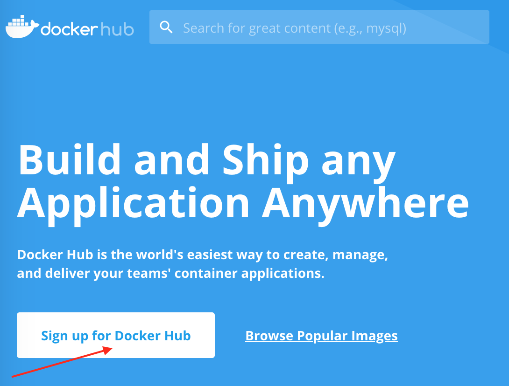

# Тестирование веб-сервиса "Путешествие дня"

## Информация о проекте
Приложение в виде веб-сервиса, который предлагает купить тур по определённой цене двумя способами:
* Обычная оплата по дебетовой карте
* Уникальная технология: выдача кредита по данным банковской карты

Само приложение не обрабатывает данные по картам, а пересылает их банковским сервисам:
* Сервису платежей, далее Payment Gate
* Кредитному сервису, далее Credit Gate

## Цель проекта
Автоматизация тестирования комплексного сервиса, взаимодействующего с СУБД и API Банка.

## Начало работы

### Предпосылки

Для работы с проектом требуется установка на персональный компьютер (далее - ПК) следующих программ: система контроля версий Git, профессиональный редактор кода IntelliJ IDEA Community, Docker.

### Установка и запуск

Скачиваем и устанавливаем на свой ПК [Git](https://git-scm.com/downloads).

Скачиваем и устанавливаем на свой ПК профессиональный редактор кода [Intellij Idea Community Version](https://www.jetbrains.com/idea/download/).

Скачиваем и устанавливаем Docker в следующем порядке:

1. Регистрируемся (получаем Docker ID) на [Docker Hub](https://hub.docker.com/):

Выбираем `Sign Up`:

Заполняем форму, регистрируемся.

2. Определяемся с вашей ОС и версией:
* Пользователи Windows 10 и Windows 11 начиная с версии 21H2 - вам нужен Docker Desktop. Установка описана [здесь](https://docs.docker.com/docker-for-windows/install/).
* Пользователи MacOS начиная с Big Sur - вам нужен Docker Desktop. Установка описана [здесь](https://docs.docker.com/docker-for-mac/install/)
* Пользователи Linux, в зависимости от дистрибутива: [Ubuntu](https://docs.docker.com/install/linux/docker-ce/ubuntu/), [Debian](https://docs.docker.com/install/linux/docker-ce/debian/). Не забудьте так же про [Post Installation](https://docs.docker.com/install/linux/linux-postinstall/)
* Пользователи Windows 7, Windows 8, неподдерживаемых версий Windows 10, Windows 11 и MacOS могут использовать виртуальную машину, предоставляемую Нетологией. [Инструкция по подключению к виртуальной машине Linux](project documentation/timeweb-instruction.md).

После установки программ клонируем командой `git clone` из удаленного репозитория CitHub [проект](https://github.com/kastra85/DRBuyingATour/tree/modification/) на свой ПК и создаем локальный репозиторий, далее запускаем его в следующем порядке:
* Запуск Docker Desktop
* Запуск контейнеров командой `docker compose up --build` в терминале IDEA
* Запуск приложения командой `java "-Dspring.datasource.url=jdbc:mysql://localhost:3306/app" -jar ./artifacts/aqa-shop.jar` для СУБД MySQL или
`java "-Dspring.datasource.url=jdbc:postgresql://localhost:5432/app" -jar ./artifacts/aqa-shop.jar` для СУБД PostgreSQL
в новой вкладке терминала IDEA
* Запуск автотестов командой `./gradlew clean test "-Ddb.url=jdbc:mysql://localhost:3306/app"` для СУБД MySQL или
`./gradlew clean test "-Ddb.url=jdbc:postgresql://localhost:5432/app"` для СУБД PostgreSQL
в новой вкладке терминала IDEA
* Запуск отчета Allure командой `./gradlew allurereport` в новой вкладке терминала IDEA
* Просмотр отчетов (файл index.html) в папке [test](build%2Freports%2Ftests%2Ftest) для Gradle и 
[allureReport](build%2Freports%2Fallure-report%2FallureReport) для Allure

## Лицензия

Для работы с вышеуказанными программами в рамках проекта достаточно бесплатных версий.

## Документация по итогам тестирования

* [Plan.md](project%20documentation%2FPlan.md)
* [Report.md](project%20documentation%2FReport.md)
* [Summary.md](project%20documentation%2FSummary.md)
